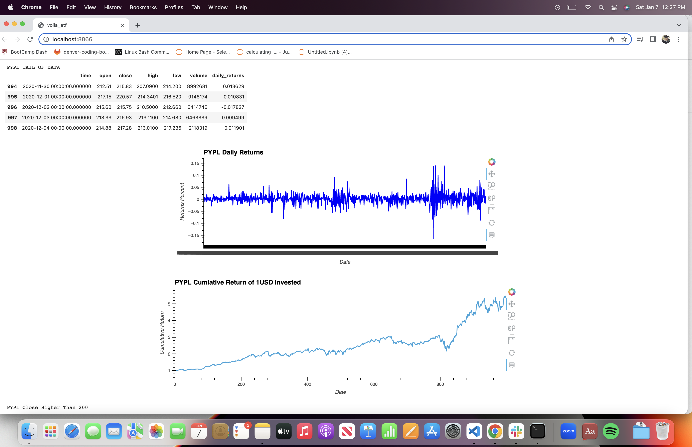
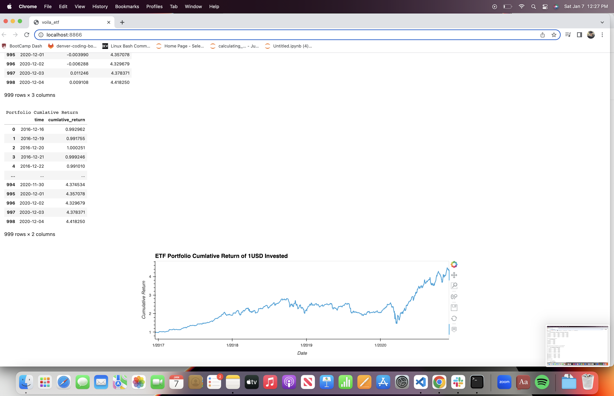

# ETF and Volia Analyzer Using Databases

This is a Jupyter Notebook that scrapes data in a database using SQL to help a with a ETF portfolio. This application looks the proformance of one ETF and also the portfolio as a whole. We tracked the returns and plotted the cumative returns. 
---

## Technologies

This project leverages python 3.7 with the following packages:

* [pandas](https://github.com/pandas-dev/pandas) - For the command line interface, help page, and entrypoint.

* [hvplot](https://github.com/holoviz/hvplot) - A high-level plotting API for pandas, dask, xarray, and networkx built on HoloViews

* [metaplot](https://github.com/matplotlib/matplotlib) - For entrypoint and help page.

* [numbpy](https://github.com/numpy/numpy) - The fundamental package for scientific computing with Python

* [sqlalchemy](https://github.com/sqlalchemy/sqlalchemy) - SQLAlchemy is the Python SQL toolkit and Object Relational Mapper that gives application developers the full power and flexibility of SQ

---

## Installation Guide

Before running the application first install the following dependencies.

```
import numpy as np
import pandas as pd
import hvplot.pandas
import sqlalchemy
```


---

## Usage

Acitvate a Jupyter Lab Notebook by having the kernal installed and typing `jupyter lab` in your terminal. 

User mush have the 'MCForcastTools.py' moduel in order to run the simulation.

---

## Examples
```
# Write a SQL SELECT statement to select the time and daily_returns columns
# Sort the results in descending order and return only the top 10 return values
query = """
SELECT time, daily_returns
FROM PYPL 
ORDER BY daily_returns DESC
LIMIT 10
"""

# Using the query, read the data from the database into a Pandas DataFrame
pypl_top_10_returns = pd.DataFrame(engine.execute(query), columns = ['time','daily_returns'])

pypl_top_10_returns['time'] = pd.to_datetime(pypl_top_10_returns['time'])

# Review the resulting DataFrame
print("Top Ten Daily Returns in Descending Order")
display(pypl_top_10_returns)
```

## Voila Images







---

## Contributors

DU Starter Code
Terrence McCoy


---

## License

MIT
